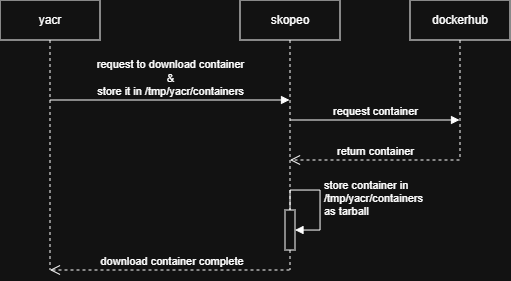
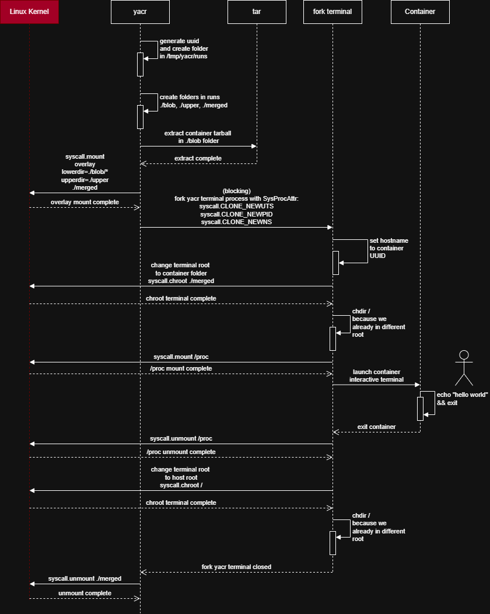

# yacr
yet another container runtime written in Go language targetting linux x86-64 containerization.

## Dependency
dependency is based on Ubuntu 24.04.2 LTS with kernel 6.8.0-101-generic.

- skopeo - download image
- jq - extract info from image's JSON
- tar - extract container from tarball. (installed by default)
- overlayfs - mount container using overlay strategy. (installed by default)

```
# install in ubuntu
sudo apt install skopeo jq
```

## build from source

```
git clone https://github.com/abdulari/yacr
cd yacr
go build
```


## getting started

1. pull image 
```
yacr pull docker.io/library/alpine:latest
```

2. run container
```
yacr run docker.io/library/alpine:latest [command]

# optional command to run
```

3. delete container
just delete the folder in /tmp/yacr/runs


## how it works - downloading container


## how it works - running container

